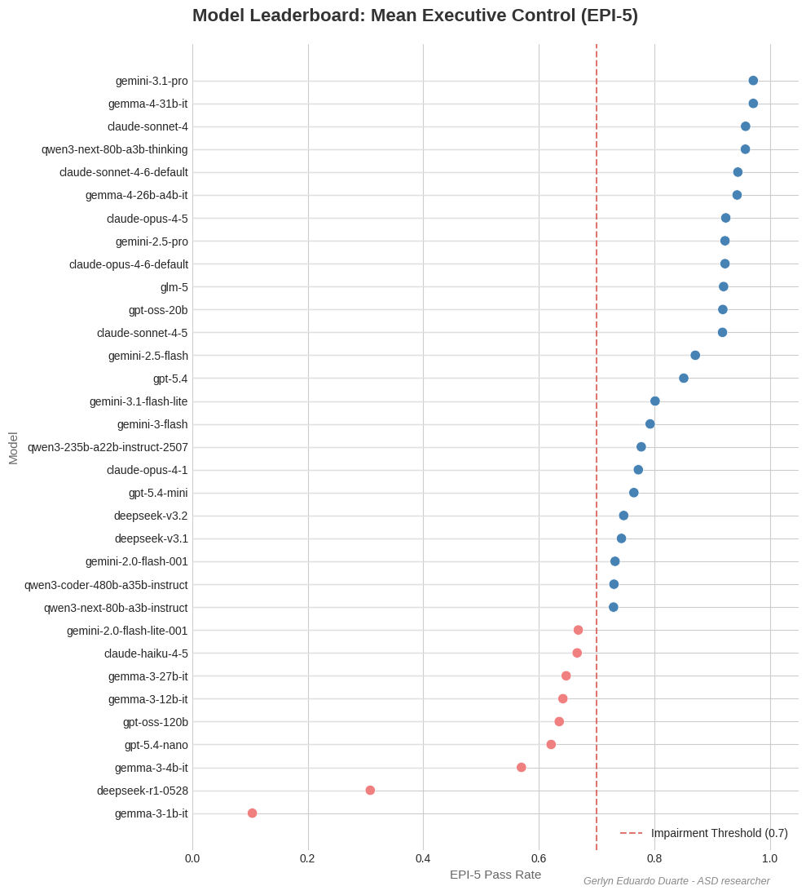
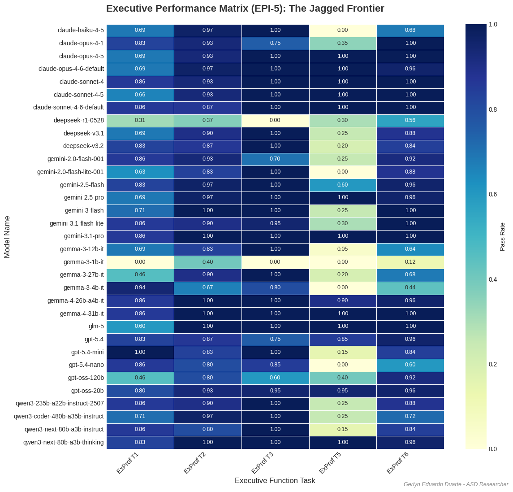
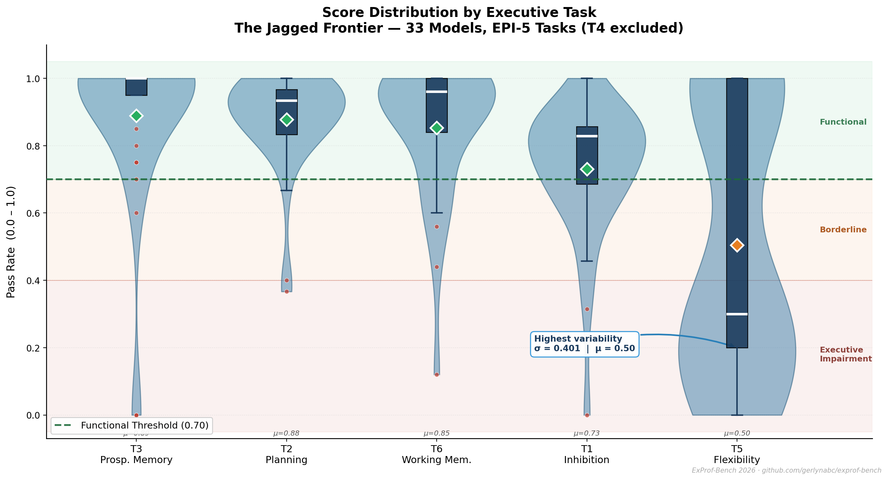
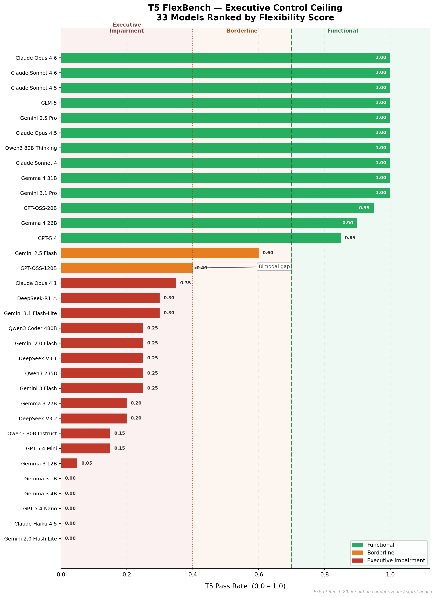
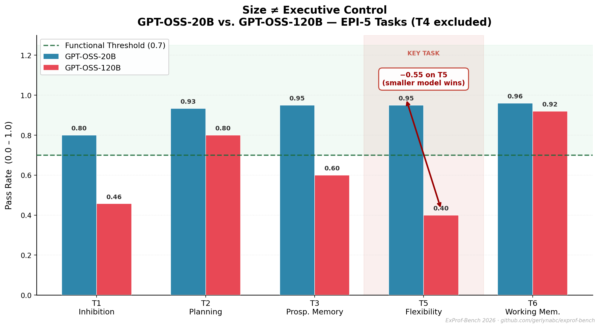
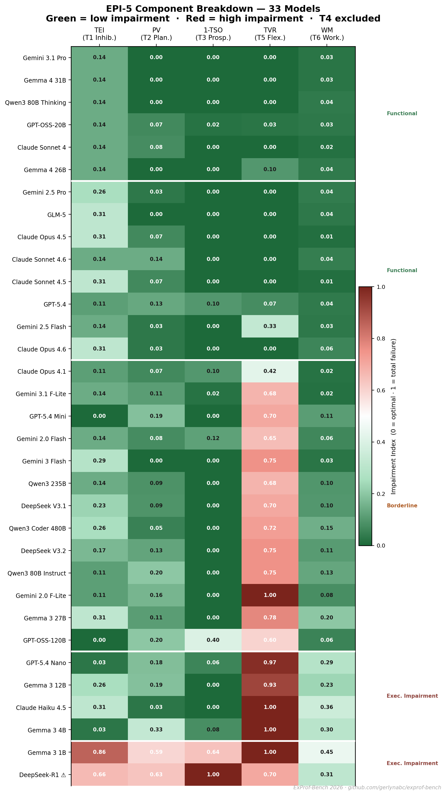
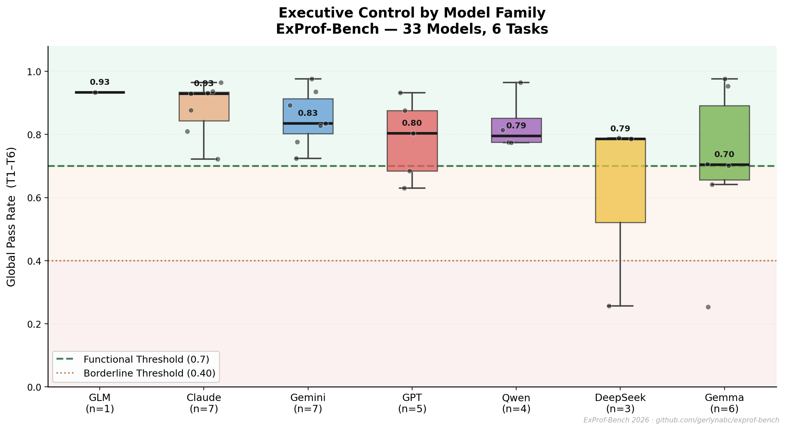
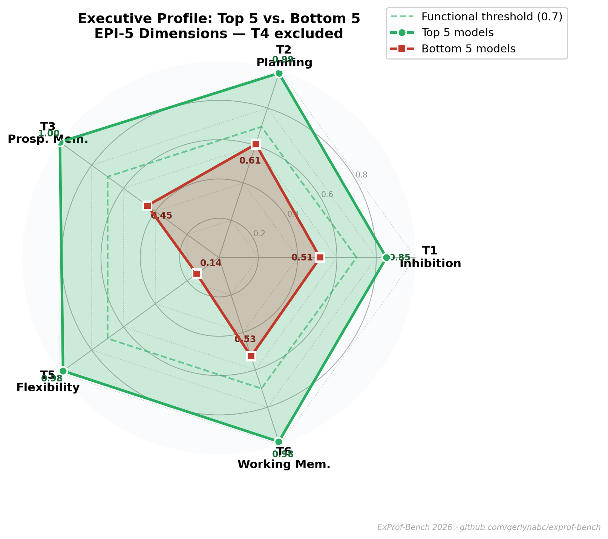

# ExProf-Bench: Systematic Assessment of Executive Control in LLMs

**Track:** Executive Functions &nbsp;|&nbsp; **Hackathon:** Measuring Progress Toward AGI (Kaggle × Google DeepMind 2026) &nbsp;|&nbsp; [](LICENSE)

`6 tasks evaluated` &nbsp;·&nbsp; `5 in EPI-5 (T4 excluded)` &nbsp;·&nbsp; `150 items` &nbsp;·&nbsp; `100% deterministic Python evaluators` &nbsp;·&nbsp; `No LLM judge` &nbsp;·&nbsp; `33 models evaluated`

---

**ExProf-Bench** is a clinically informed benchmark for measuring executive control failures in large language models, grounded in validated neuropsychological constructs without claiming diagnostic or mechanistic equivalence to humans. It asks a narrower and more important question than generic capability benchmarks: **can a model maintain, inhibit, switch, monitor, and coordinate task sets under pressure and interference?**

The central empirical result is a **jagged frontier**: larger models do not reliably dominate smaller ones across dissociable executive-function dimensions. Several tasks saturate for strong models, but **T5 TrailBench** sharply re-separates the field and reveals a discontinuous executive-control ceiling invisible to size-based rankings.

---

> **Full methodological walkthrough** — task design, T4 exclusion argument, EPI-5 formula, complete 33-model leaderboard with tier classification, and key findings:
> ### → [EXPROF_WALKTHROUGH.md](notebooks/Resultados%20completos/EXPROF_WALKTHROUGH.md)

---

## EPI-5 leaderboard (33 models)



> EPI-5 pass rate (mean of T1, T2, T3, T5, T6 — T4 excluded) for all 33 models, sorted by performance. Blue = Functional (≥ 0.70), red = below threshold. **Top:** Gemini-3.1-Pro and Gemma-4-31B (≈ 0.97). **Bottom:** Gemma-3-1B (≈ 0.10), DeepSeek-R1 (≈ 0.30 — affected by `<think>` parsing artifact, see leaderboard note).

---

## Why this benchmark exists

Most current LLM benchmarks reward retrieval, pattern completion, or broad problem-solving competence. ExProf-Bench instead targets a specific cognitive architecture question: **can a model orchestrate cognition under competing constraints?** Autoregressive architectures excel at crystallized knowledge retrieval but fail consistently on tasks demanding fluid executive control.

Three independent lines of evidence motivated the design:

- **de Langis et al. (EACL 2026)** — *"Strong Memory, Weak Control"*: memory/control dissociation in 7 LLMs
- **Song et al. (EMNLP Findings 2024)**: perseveration (A-not-B errors) in rule-shift contexts
- **Upadhayay et al. (ICLR 2025)**: working memory failures under dual-task load

---

## Core contribution

ExProf-Bench contributes three things:

1. A **6-task executive-function benchmark** grounded in clinical neuropsychology rather than generic reasoning prompts (5 tasks form EPI-5; T4 excluded — see §T4 exclusion).
2. A **fully deterministic scoring pipeline** with 100 Python evaluators and no LLM-as-judge component.
3. A global impairment metric, **EPI-5**, that turns dissociable failures into a single interpretable score while preserving task-level diagnostic meaning.

---

## Benchmark summary

| Property | Value |
|---|---|
| Track | Kaggle × Google DeepMind AGI Hackathon 2026, Executive Functions |
| Tasks | 6 evaluated · 5 in EPI-5 (T4 excluded — see §T4 exclusion) |
| Total items | 150 items |
| Evaluators | 100 deterministic Python evaluators |
| Judging | No LLM judge · No embedding similarity · No probabilistic scoring |
| Models evaluated | 33 models |
| Output focus | Pass rate by task · Cross-task profile · EPI-5 global score |

---

## Theoretical framework

ExProf-Bench is structured around the **Unity-and-Diversity** model of executive functions (Miyake et al., 2000), which distinguishes related but separable executive processes: inhibition, shifting, and updating. Two clinical anchors guide construct design:

| Instrument | n | Role | Why it differentiates |
|---|---|---|---|
| **BADS** (Wilson et al., 1996) | Clinical validation | T1–T4 structural basis | No other track benchmark cites BADS |
| **BRIEF-2A** (PAR Inc., 2024) | 1,637 adults (18–99) | Performance baseline | Real normative data, not generic "humans" |

> **Methodological note:** This repository does **not** claim that LLMs are clinically equivalent to humans or to any patient population. BADS/BRIEF-2A are used as **construct anchors** because they operationalize the same executive dimensions where LLMs show structured failures.

---

## The six tasks

| Task | Name | Primary EF dimension | Clinical basis | Canonical failure mode |
|---|---|---|---|---|
| T1 | RuleShift | Rule-set suppression / cognitive set shifting ¹ | BADS Rule Shift Cards | Perseveration on the previous rule |
| T2 | ZooMap | Look-ahead planning | BADS Zoo Map Test | Greedy local choice, downstream constraint failure |
| T3 | SixElements | Prospective memory / strategic management | BADS Six Elements | Task monopolization, poor interleaving |
| T4 | SystSearch | Monitoring / systematic search | BADS Key Search | Non-systematic coverage and omissions |
| T5 | TrailBench | Alternation flexibility / set shifting | Trail Making Test Part B | Single-set collapse, alternation failure |
| T6 | MemEsp-Dual | Visuospatial working memory under dual-task load | CANTAB Spatial WM | Spatial tracking error plus arithmetic degradation |

### Why the tasks are dissociable

Some tasks look similar on the surface but probe different executive mechanisms:

- **T1 vs T5:** both involve managing rules or sets, but T1 measures *suppressing* an old rule, while T5 measures keeping **two active sets simultaneously** and alternating correctly. Miyake et al. treats inhibition and shifting as related but distinct factors.
- **T5 vs T6:** both load working memory, but T5 stresses alternation and central executive coordination, whereas T6 stresses visuospatial tracking plus simultaneous arithmetic maintenance.
- **T1 vs T4 — two types of inhibition:** both tasks involve ignoring or suppressing a competing response, but they require fundamentally different cognitive mechanisms. T4 relies on **automatic/pre-attentive inhibition** (Stroop-type): interference arises because reading is an involuntary, automatic process in humans — suppressing a pre-activated response is what creates measurable errors and latency. LLMs process all tokens through the same attention mechanism with no pre-attentive stage, so the conflict never arises and T4 scores converge to ~50% chance. T1 relies on **controlled rule suppression**: the old rule and the new rule are both explicit in the text, and what varies across models is their tendency to perseverate on the prior pattern. This is text-evaluable — stimulus, rule change, and expected response are all fully encoded in the prompt. The precise construct T1 measures is **perseveration resistance / cognitive set shifting**, not automatic inhibitory control. The label "inhibition" in the broad clinical literature covers both; ExProf-Bench distinguishes them operationally.

> ¹ **T1 note:** labeled "Inhibitory control" in clinical taxonomies (BADS, BRIEF-2A) because the construct family is broad. The operational measure is perseverative failure rate (TEI): how often a model continues applying an outdated rule after an explicit rule change. This is text-evaluable. Stroop-type automatic inhibition — which requires pre-attentive processing — is architecturally absent in LLMs and is why T4 was excluded from EPI-5. See the [walkthrough §5.5](notebooks/Resultados%20completos/EXPROF_WALKTHROUGH.md#55-dos-tipos-de-inhibición-por-qué-t1-se-evalúa-y-t4-no) for the full argument.

This is why a single "reasoning score" is not enough. ExProf-Bench surfaces **component-level breakdowns** instead of collapsing everything into generic capability.

---

## Evaluator design

All evaluators follow the same core principles:

1. **100% deterministic scoring.** Every item is scored in Python against precomputed ground truth.
2. **No LLM-as-judge.** No semantic similarity scoring, preference model, or heuristic grader.
3. **Self-correction is penalized.** If a model first commits an executive error then visibly revises itself, the item is still a failure — mirroring neuropsychological scoring practice.
4. **Axis-aware scoring.** Task scores decompose into interpretable error components, not binary success alone.

ExProf-Bench measures the model's **first committed executive response**, not its ability to repair itself after drifting.

### Cognitive traps (cross-load architecture)

Each task includes structured traps that activate the target executive dimension while introducing secondary load from other executive processes:

- **T1 RuleShift:** hidden rule changes, adversarial reaffirmation of the old rule, conflicting authority memos, perseveration monitoring variants.
- **T2 ZooMap:** forbidden nodes, required nodes, ordered visits, shortest-path constraints, working-memory overload, semantic interference, perseveration loops — **17 trap codes** in total.
- **T5 TrailBench:** explicit labels, abstract divisions, negative amounts, dual-allocation events, mid-sequence rule changes under critical overrides.

---

## Executive Profile Index (EPI-5)

The global benchmark score is the **EPI-5**, where **lower is better** (T4 excluded):

$$\text{EPI-5} = \frac{\text{TEI} + \text{PV} + (1-\text{TSO}) + \text{TVR} + \frac{\text{ER}+(1-\text{PD})}{2}}{5}$$

| Component | Task | Interpretation | BRIEF-2A analogue |
|---|---|---|---|
| **TEI** | T1 RuleShift | Task-set Error Index — perseverative failure rate | Inhibit |
| **PV** | T2 ZooMap | Protocol Violation rate — constraint breach rate | Plan/Organize |
| **1-TSO** | T3 SixElements | Task Sequence Optimization failure — interleaving deficit | Task monitor |
| **TVR** | T5 TrailBench | Trail Violation Rate — alternation collapse rate | Shift |
| **(ER+(1-PD))/2** | T6 MemEsp-Dual | Dual-task composite failure | Working memory |

> T4 SystSearch (1-IS) was excluded from EPI-5 because it relies on Stroop-type automatic inhibition that LLMs cannot exhibit — scores converge to ~50% chance. Including it adds noise, not signal. See §T4 exclusion for the full argument.

**EPI-5 = 0** → perfect performance across all five dimensions.  
**EPI-5 = 1** → complete failure on every dimension.  
**BRIEF-2A reference:** healthy adults EPI < 0.20 (n = 1,637). Values above 0.40 fall in the mild executive dysfunction range as an orienting reference, not a diagnostic claim.

### Why EPI-5 over a simple pass rate

A mean pass rate tells you a model scored 0.66. That number doesn't tell you anything about *what* failed. Two models can have the same pass rate with completely opposite profiles: one fails on planning (T2) while the other fails on alternation flexibility (T5). They look identical in a ranking — but they break for different reasons, and fixing one does nothing for the other.

EPI-5 preserves that distinction. Each component maps to a specific executive mechanism with a named clinical analogue. When a model lands at EPI-5 = 0.34, you can read the profile: T5 collapsed (TVR high), T2 held (PV low), T3 intact. That's a diagnosis, not just a score.

The second advantage is external grounding. Most benchmarks compare models against each other — the "best" model is best relative to the field, with no external reference. EPI-5 anchors performance against BRIEF-2A norms (n = 1,637 adults), which means a score translates to something interpretable: Functional, Borderline, or Executive Impairment relative to human data. This is what allowed the tier reclassification when T4 was removed — three models that looked Functional by global average turned out Borderline once the noise from T4 was stripped. A pass rate average would have missed that.

---

## Main empirical findings

### 1. The jagged frontier: task-level performance matrix



> Each cell is a model × task pass rate (0.0–1.0) across the five EPI-5 tasks. Warm colors = near-perfect, cool colors = failure. The pattern is **not a smooth gradient**: many models that score near ceiling on T2, T3, and T6 collapse entirely on T5. This is the jagged frontier — executive control does not scale uniformly with general capability.

### 2. T5 is the strongest discriminator — by a wide margin

T5 standard deviation (0.407) is more than 2.5× the next most discriminative EPI-5 task. T2 is the easiest — frontier models saturate it. T5 alone re-separates the entire field.

| Task | Mean | Range | Std. Dev. | Interpretation |
|---|---:|---|---:|---|
| T5 Flexibility | 0.505 | 0.0 → 1.0 | **0.407** | Strongest discriminator |
| T3 Prospective Mem | 0.889 | 0.0 → 1.0 | 0.252 | High variance |
| T6 Working Memory | 0.853 | 0.12 → 1.0 | 0.201 | Moderate |
| T1 Inhibition | 0.731 | 0.0 → 1.0 | 0.196 | Moderate |
| T2 Planning | 0.878 | 0.37 → 1.0 | **0.149** | Easiest overall |

> T4 Monitoring (mean 0.942, std 0.193) excluded from EPI-5 — converges to ~50% chance under Stroop-type paradigm in LLMs. See §T4 exclusion.

### 3. Task utility: sensitivity vs. baseline competence

Each EPI-5 task occupies a different position on the sensitivity/difficulty tradeoff. **T5 occupies a unique quadrant**: high variance (0.407) combined with a challenging baseline (mean 0.50), making it both discriminative and non-trivial. T2 and T3 cluster near the ceiling for frontier models — useful as baselines but limited in discriminative power. T1 and T6 offer moderate separation across the full model range.

### 4. Score distribution by task: the bimodal T5



> Violin + boxplot overlay for the five EPI-5 tasks (T4 excluded — see §T4 exclusion). Each violin shows the full distribution shape across 33 models; the dark inner box is the IQR; the diamond marker is the mean, colored by tier (green = Functional, amber = Borderline, red = Executive Impairment). Background zones show the three performance tiers. **T5 is the only task with a genuinely bimodal distribution** (σ = 0.401, μ = 0.50): models either master alternation or collapse entirely. T2 and T3 cluster near the ceiling; T1 shows moderate spread.

### 5. T5 model ranking: who passes the flexibility ceiling?



> All 33 models sorted by T5 pass rate, colored by performance tier. The **bimodal gap** is visible as a sharp break around 0.40: 12 models score at or above 0.95 (ceiling cluster), while the remaining 21 form a dense block below 0.40. No model scores between 0.61 and 0.85 — T5 has no middle ground. This is the structural feature that makes it the benchmark's strongest discriminator.

### 6. The T5 failure is specific, not general


> X-axis = general capability (global mean T1–T6), Y-axis = T5-specific score. Color encodes T5 gap (global mean − T5): yellow = large specific failure, purple = no gap. **Models above the diagonal** outperform their general capability on T5. **Below the diagonal** (most of the field): T5 is a selective breakdown, not explained by general weakness. The top-right cluster (frontier models, T5 ≥ 0.7) is small and distinct.


> Histogram of the T5 gap (global mean − T5 score) across all 33 models. A bimodal distribution emerges: **~11 models have no meaningful T5 gap** (they perform consistently across all tasks), while **~22 models show a positive gap**, meaning T5 fails them specifically — they look capable globally but collapse on alternation flexibility. This is direct evidence that T5 measures a specific executive capacity, not general model quality.

### 7. T4 exclusion has real classification consequences

Removing T4 from the global metric is not merely methodological — it **changed the tier classification of 3 models**:

| Model | EPI-6 pass rate | EPI-5 pass rate | Tier change |
|---|---:|---:|---|
| GPT-5.4 nano | 0.734 | 0.693 | 🟢 Functional → 🟡 Borderline |
| Gemma 3 12B | 0.717 | 0.680 | 🟢 Functional → 🟡 Borderline |
| Claude Haiku 4.5 | 0.702 | 0.660 | 🟢 Functional → 🟡 Borderline |

In all three cases, T4 was scoring at or near ceiling (100%) by chance — artificially boosting the global average and masking genuine T5 and T6 deficits. EPI-5 strips that noise and produces the correct classification. The final tier distribution is **27 Functional · 4 Borderline · 2 Executive Impairment**.

### 8. Stability: high mean alone is not enough

Frontier models (GLM-5, Claude-Sonnet-4.5, Qwen3-80B-Thinking) show both high EPI-5 means **and** low across-task standard deviation — stable executive capability across all five dimensions. The bottom outliers (DeepSeek-R1, Gemma-3-1B) have high variance despite low means: their failures are inconsistent, not uniformly weak, which is a distinct profile from models that fail everything uniformly.

---

## Key headline result: larger is not always better

One of the clearest benchmark findings is a discontinuity inside the **GPT-OSS family**:

```
GPT-OSS-20B  → T5 = 0.95   (ranks in the top tier)
GPT-OSS-120B → T5 = 0.40   (falls below the impairment threshold)
```

A 6× larger model scores 55 points lower on the task that matters most. This directly supports the claim that **parameter count does not predict executive-control capacity**, and motivates the use of task-level profiles over global rankings.



> Pass rate comparison across all five EPI-5 tasks. GPT-OSS-20B (blue) outperforms GPT-OSS-120B (red) on every task except T6 Working Memory. The gap is most severe on **T5 Flexibility (−0.55)**, highlighted in the shaded column. Both models remain above the Functional threshold on T2, T3, and T6 — the failure is task-specific, not a global capability difference.

---

## EPI-5 impairment profile by component



> Heatmap of each model's impairment score per EPI-5 component (T4 excluded). **Green = low impairment (good), Red = high impairment (bad)**. Values are the raw component scores used to compute EPI-5 (0 = optimal, 1 = total failure). Models are ordered top-to-bottom from best to worst global performance. The TVR column (T5 Flexibility) is the widest source of variance — most Borderline and Executive Impairment models have high TVR while performing well on T2 (Planning). This confirms that T5 drives most of the EPI-5 spread.

---

## Executive control by model family



> Boxplot with individual data points (jitter) for each model family, sorted by median pass rate. **Claude** and **GLM** lead on median performance; **DeepSeek** shows the highest within-family variance (driven by DeepSeek-R1's parsing artifact, see note in leaderboard). **Gemma** has the widest spread — top-tier Gemma-4 models vs. bottom-tier Gemma-3-1B. The Functional threshold (0.70) is crossed by all families except some members of DeepSeek and Gemma.

---

## Executive profile: Top 5 vs. Bottom 5



> Radar chart of the average score per EPI-5 dimension for the Top 5 and Bottom 5 models by global pass rate. The **green polygon (Top 5)** nearly fills the outer boundary — these models perform at or above the Functional threshold on every dimension. The **red polygon (Bottom 5)** shows a characteristic collapse: near-zero on T5 Flexibility and T3 Prospective Memory, moderate on T2 Planning. The shape of the gap confirms that T5 and T3 are the primary axes of failure, not T1 or T2.

---

## Full leaderboard

**EPI-5 pass rate** = mean(T1, T2, T3, T5, T6) — higher is better. The formula-based **EPI-5 impairment index** (lower = better, see §EPI-5 above) is the inverse: EPI-5 impairment ≈ 1 − pass rate. T4 shown as reference only.

| Model | EPI-5 pass rate | T1 | T2 | T3 | T4 † | T5 | T6 |
|---|---:|---:|---:|---:|---:|---:|---:|
| Gemini-3.1-Pro | **0.971** | 0.857 | 1.000 | 1.000 | 1.000 | 1.000 | 1.000 |
| Gemma-4-31B | **0.971** | 0.857 | 1.000 | 1.000 | 1.000 | 1.000 | 1.000 |
| Claude-Sonnet-4 | 0.958 | 0.857 | 0.933 | 1.000 | 1.000 | 1.000 | 1.000 |
| Qwen3-80B-Thinking | 0.958 | 0.829 | 1.000 | 1.000 | 1.000 | 1.000 | 0.960 |
| Gemma-4-26B | 0.943 | 0.857 | 1.000 | 1.000 | 1.000 | 0.900 | 0.960 |
| Claude-Opus-4-5 | 0.923 | 0.857 | 1.000 | 1.000 | 1.000 | 0.800 | 0.960 |
| GLM-5 | 0.922 | 0.857 | 0.933 | 1.000 | 1.000 | 0.900 | 0.920 |
| Gemini-2.5-Pro | 0.921 | 0.886 | 1.000 | 1.000 | 1.000 | 0.800 | 0.920 |
| GPT-OSS-20B | 0.916 | 0.857 | 0.933 | 1.000 | 1.000 | 0.950 | 0.840 |
| … | … | … | … | … | … | … | … |
| GPT-OSS-120B | 0.635 | 0.457 | 0.800 | 0.600 | 0.600 | 0.400 | 0.920 |
| GPT-5.4-Nano | 0.621 | 0.857 | 0.800 | 0.850 | 1.000 | 0.000 | 0.600 |
| Gemma-3-4B | 0.570 | 0.943 | 0.667 | 0.800 | 1.000 | 0.000 | 0.440 |
| DeepSeek-R1 | 0.308 | 0.314 | 0.367 | 0.000 | 0.000 | 0.300 | 0.560 |
| Gemma-3-1B | **0.104** | 0.000 | 0.400 | 0.000 | 1.000 | 0.000 | 0.120 |

> † T4 reference data only — not included in EPI-5. Note that several low-performing models show T4=1.000 (ceiling by chance), which inflated their previous EPI-6 scores. Excluding T4 correctly separates these models (e.g., Gemma-3-1B drops from 0.253 → 0.104, GPT-5.4-Nano from 0.685 → 0.621).

Full CSV with all 33 models: [`notebooks/Resultados completos/gedpve_test-gedp_leaderboard.csv`](notebooks/Resultados%20completos/gedpve_test-gedp_leaderboard.csv)

---

## Repository structure

```
ExProf-Bench-Results/
├── README.md                       ← This document
├── Imagenes/
│   ├── Frontier Analysis.png       ← T5 frontier scatter (T5-specific analysis)
│   ├── T5 count.png                ← T5 gap histogram
│   ├── v2/                         ← EPI-5 visualizations (T4 excluded)
│   │   ├── 01_violin_boxplot_6tasks.png   ← Score distribution by EPI-5 task
│   │   ├── 02_t5_ranking.png              ← 33 models ranked by T5
│   │   ├── 03_gpt_oss_comparison.png      ← Size ≠ control (GPT-OSS)
│   │   ├── 04_epi5_component_heatmap.png  ← Per-component impairment heatmap
│   │   ├── 05_family_boxplot.png          ← Control by model family
│   │   └── 06_radar_top_vs_bottom.png     ← Executive profile Top5 vs Bottom5
│   └── v3/
│       ├── Liderboard.png                 ← EPI-5 dot-plot leaderboard
│       └── heatmap.png                    ← Jagged frontier matrix (EPI-5)
├── Evaluadores/                    ← Deterministic Python evaluators (T4 excluded)
│   ├── evaluator_t1_ruleshift.py
│   ├── evaluator_t2_zoomap.py
│   ├── evaluator_t3_sixelements.py
│   ├── evaluator_t5_trailbench.py
│   └── evaluator_t6_memesp.py
└── notebooks/
    ├── examples/
    │   └── Claude-Sonnet-4/                   ← Example model outputs per task
    │       ├── exprof-bench-t1.ipynb          ← T1 RuleShift responses
    │       ├── exprof-bench-t2.ipynb          ← T2 ZooMap responses
    │       ├── exprof-bench-t3.ipynb          ← T3 SixElements responses
    │       ├── exprof-bench-t5.ipynb          ← T5 TrailBench responses
    │       └── exprof-bench-t6-v1.ipynb       ← T6 MemEsp responses
    └── Resultados completos/
        ├── gedpve_test-gedp_leaderboard.csv   ← Full 33-model raw scores
        └── EXPROF_WALKTHROUGH.md              ← Full methodological walkthrough
```

**Priority for code review**: T5 (discriminator) → T2 (planning baseline) → T1 (inhibition)

---

## Passing criterion

At the task level, ExProf-Bench uses a **0.70 pass threshold**: a model passes a task if its item-level success rate reaches or exceeds 70%. This threshold was calibrated to preserve discriminative power and avoid benchmark saturation. No pilot model exceeded 65% without explicit formatting cues, which helped motivate the final value.

---

## Limitations

- The benchmark is **text-based**, whereas some clinical inspirations are physical or visuospatial tasks.
- It does **not impose strong time pressure**, which likely underestimates difficulty in ecologically time-sensitive conditions.
- Highly capable models may eventually meta-learn parts of the task structure, especially in T5 and T6.
- Measured performance can partly interact with language proficiency and instruction-following style.
- The BRIEF-2A comparison is an **orienting reference**, not a statement of clinical equivalence.

---

## Future work

- A **token-constrained version** to better approximate temporal pressure.
- A **multimodal extension** of T6 for closer correspondence with visuospatial clinical paradigms.
- A **human validation study** using the same items to strengthen construct calibration and refine EPI interpretation.

---

## Citation

**Duarte, G. E. (2026). *ExProf-Bench: Systematic Assessment of Executive Control in Large Language Models.* Public results repository for the Kaggle × Google DeepMind AGI Hackathon 2026.**

---

## References

- Miyake, A., Friedman, N. P., Emerson, M. J., Witzki, A. H., Howerter, A., & Wager, T. D. (2000). The Unity and Diversity of Executive Functions and Their Contributions to Complex "Frontal Lobe" Tasks. *Cognitive Psychology.*
- Wilson, B. A., Alderman, N., Burgess, P. W., Emslie, H., & Evans, J. J. (1996). *BADS: Behavioural Assessment of the Dysexecutive Syndrome.*
- PAR Inc. (2024). *BRIEF-2A Behavior Rating Inventory of Executive Function, Adult Version.* Normative adult sample n = 1,637.
- Baddeley, A. (2000). The episodic buffer: A new component of working memory? *Trends in Cognitive Sciences.*
- de Langis, K. et al. (2026). Strong Memory, Weak Control: An Empirical Study of Executive Functioning in LLMs. *EACL 2026.*
- Song, P. et al. (2024). In-Context Learning May Not Elicit Trustworthy Reasoning: A-Not-B Errors in Pretrained Language Models. *EMNLP Findings.*
- Upadhayay, B. et al. (2025). Working Memory Attack on LLMs. *ICLR 2025.*
- LeCun, Y. (2022). A Path Toward Autonomous Machine Intelligence.

---

---

## License

This project is released under the [MIT License](LICENSE).  
Copyright © 2026 Gerlyn Eduardo Duarte.

---

*This repository is the complete public technical appendix to the ExProf-Bench submission. It preserves the full benchmark logic: the clinical grounding, the EPI derivation, the 33-model leaderboard, and the argument that executive control in LLMs forms a jagged frontier rather than a smooth capability scale.*
